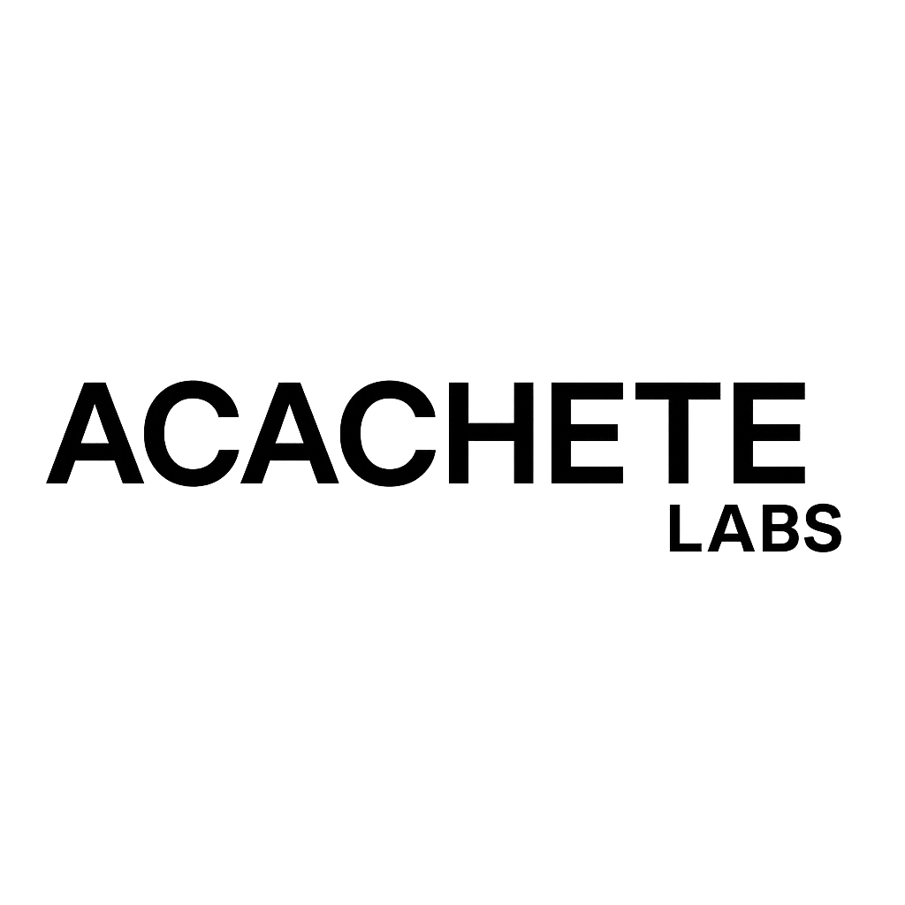
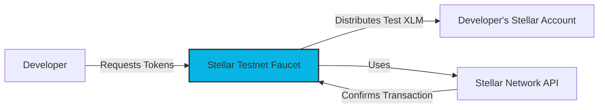
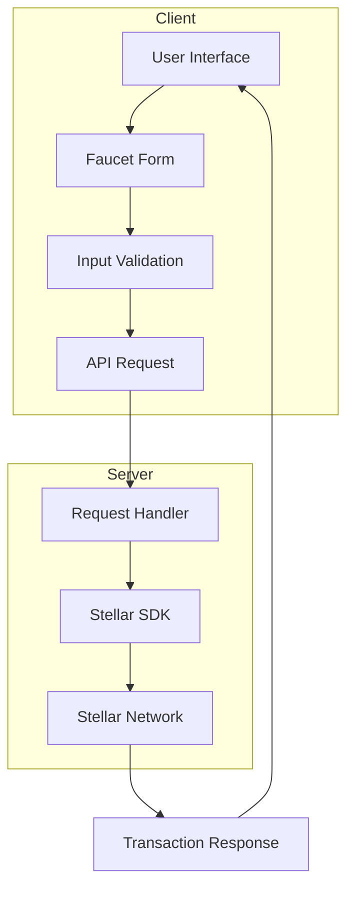

<div align="center">

# Stellar Testnet Faucet



### A Modern, Reliable Alternative to Stellar Friendbot

[](https://nextjs.org/)
[](https://www.typescriptlang.org/)
[](https://developers.stellar.org/docs)
[](LICENSE)

[View Demo](https://acachete.xyz) • [Report Bug](https://github.com/salazarsebas/acachete-faucet/issues) • [Request Feature](https://github.com/salazarsebas/acachete-faucet/issues)

</div>

## 📋 Table of Contents

- [Overview](#-overview)
- [Features](#-features)
- [System Architecture](#-system-architecture)
- [Getting Started](#-getting-started)
- [Usage](#-usage)
- [API Reference](#-api-reference)
- [Deployment](#-deployment)
- [Contributing](#-contributing)
- [License](#-license)
- [Contact](#-contact)
- [Acknowledgements](#-acknowledgements)

## 🌟 Overview

The Stellar Testnet Faucet is a web application developed by Acachete Labs that provides free test tokens (XLM) for Stellar blockchain development. It serves as a reliable alternative to the official Stellar Friendbot with enhanced features and improved reliability.

<div align="center">



</div>

## ✨ Features

- **Multi-Network Support**: Distribute tokens on both Testnet and Futurenet
- **Higher Distribution Limits**: More tokens than the official Friendbot
- **Transaction Tracking**: View transaction IDs and status
- **Modern UI/UX**: Clean, responsive interface with dark mode support
- **SEO Optimized**: Enhanced discoverability for developers

## 🏗️ System Architecture

<div align="center">



</div>

### Technology Stack

| Component | Technology | Description |
|-----------|------------|-------------|
| Frontend | Next.js 15.5.2 | React framework with App Router |
| Styling | Tailwind CSS 4.x | Utility-first CSS framework |
| UI Components | shadcn/ui | Accessible component system |
| Blockchain Integration | Stellar SDK 14.1.1 | Official Stellar JavaScript SDK |
| Deployment | Vercel | Edge-optimized hosting platform |

## 🚀 Getting Started

### Prerequisites

- Node.js 18.x or higher
- Bun or npm

### Installation

1. Clone the repository
   ```bash
   git clone https://github.com/salazarsebas/acachete-faucet.git
   cd acachete-faucet
   ```

2. Install dependencies
   ```bash
   bun install
   ```

3. Start the development server
   ```bash
   bun dev
   ```

4. Open [http://localhost:3000](http://localhost:3000) in your browser

## 💻 Usage

<div align="center">
<details>
<summary><b>Click to view usage instructions</b></summary>

### Step 1: Select Network
Choose between Testnet or Futurenet based on your development needs.

### Step 2: Enter Stellar Address
Provide your public Stellar address (starting with 'G').

### Step 3: Request Tokens
Click the "Get Test Tokens" button to receive XLM.

### Step 4: View Transaction
After successful funding, you'll see the transaction ID and confirmation.

</details>
</div>

## 🤝 Contributing

Contributions are welcome! Please feel free to submit a Pull Request.

1. Fork the Project
2. Create your Feature Branch (`git checkout -b feature/AmazingFeature`)
3. Commit your Changes (`git commit -m 'Add some AmazingFeature'`)
4. Push to the Branch (`git push origin feature/AmazingFeature`)
5. Open a Pull Request

## 📄 License

Distributed under the MIT License. See `LICENSE` for more information.

## 📬 Contact

Acachete Labs - [@salazarsebas](https://x.com/ssalazar_dev)

Project Link: [https://github.com/salazarsebas/acachete-faucet](https://github.com/salazarsebas/acachete-faucet)

## 🙏 Acknowledgements

- [Stellar Development Foundation](https://stellar.org)
- [Next.js](https://nextjs.org/)
- [Tailwind CSS](https://tailwindcss.com/)
- [shadcn/ui](https://ui.shadcn.com/)

---

<div align="center">

**Made with ❤️ by [Acachete Labs](https://acachete.xyz)**

<a href="https://acachete.xyz"></a>

</div>
