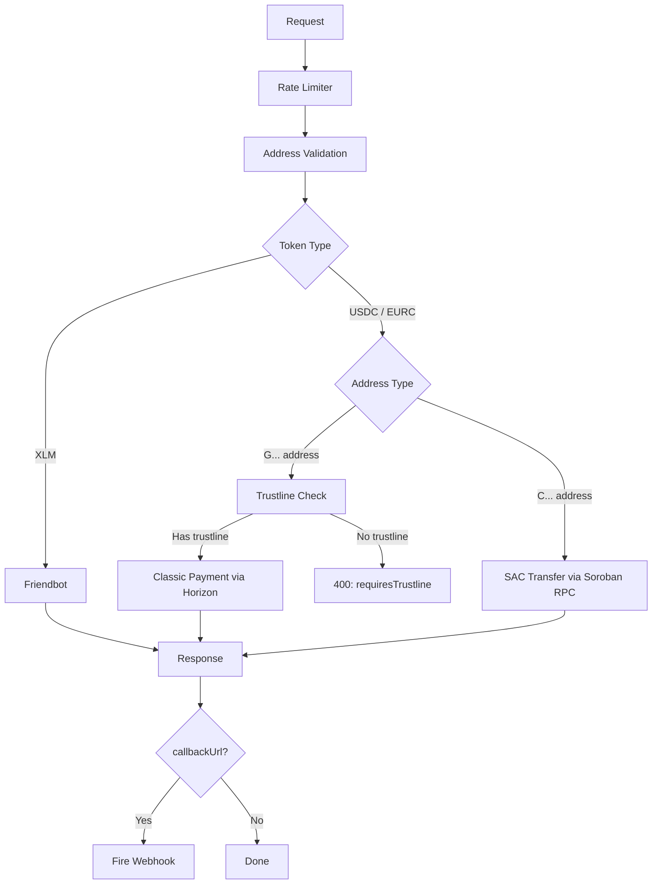

<div align="center">


# Acachete Stellar Testnet Faucet

### Multi-token faucet for Stellar testnet and futurenet

[](https://nextjs.org/)
[](https://www.typescriptlang.org/)
[](https://developers.stellar.org/docs)
[](LICENSE)

[Live Demo](https://faucet-stellar.acachete.xyz) | [Report Bug](https://github.com/salazarsebas/acachete-faucet/issues) | [Request Feature](https://github.com/salazarsebas/acachete-faucet/issues)

</div>

## Table of Contents

- [Overview](#overview)
- [Features](#features)
- [Architecture](#architecture)
- [Technology Stack](#technology-stack)
- [Supported Tokens](#supported-tokens)
- [Getting Started](#getting-started)
- [API Reference](#api-reference)
- [Rate Limits](#rate-limits)
- [Webhooks](#webhooks)
- [Environment Variables](#environment-variables)
- [Setup Scripts](#setup-scripts)
- [CI/CD](#cicd)
- [Internationalization](#internationalization)
- [Contributing](#contributing)
- [License](#license)
- [Contact](#contact)
- [Acknowledgements](#acknowledgements)

## Overview

Acachete Stellar Testnet Faucet is a multi-token faucet that distributes XLM, USDC, and EURC on both Stellar testnet and futurenet. It supports classic `G...` addresses and Soroban contract `C...` addresses, making it suitable for both traditional Stellar development and smart contract work.

The faucet provides a developer API with batch funding for up to 10 addresses, a balance checker, network status endpoint, and optional webhooks for async notifications. Requests are protected by per-IP and per-address rate limiting with standard rate limit headers.

The UI is available in English, Spanish, and Portuguese, includes dark mode, and features a trustline education page to help developers understand trustlines before requesting tokens.

## Features

**Token Distribution**

- XLM via Friendbot (10,000 XLM per request)
- USDC via Circle testnet issuer (100 USDC per request)
- EURC via Circle testnet issuer (100 EURC per request)

**Soroban SAC Support**

- `C...` (contract) addresses receive tokens via Stellar Asset Contract transfer
- No trustline needed for contract addresses
- `G...` addresses use classic payments and require trustlines for USDC/EURC

**Multi-Network**

- Testnet and Futurenet support for all operations

**Developer API**

- Batch funding (up to 10 addresses per request)
- Account balance checker
- Network status and health endpoint
- Optional webhook callbacks on all funding endpoints
- Rate limit headers on every response

**UI/UX**

- Internationalization (English, Spanish, Portuguese)
- Dark mode with system preference detection
- Framer Motion animations
- Trustline education page

## Architecture


```mermaid
flowchart TD
    A[Request] --> B[Rate Limiter]
    B --> C[Address Validation]
    C --> D{Token Type}

    D -->|XLM| E[Friendbot]
    D -->|USDC / EURC| F{Address Type}

    F -->|G... address| G[Trustline Check]
    G -->|Has trustline| H[Classic Payment via Horizon]
    G -->|No trustline| I[400: requiresTrustline]

    F -->|C... address| J[SAC Transfer via Soroban RPC]

    E --> K[Response]
    H --> K
    J --> K
    K --> L{callbackUrl?}
    L -->|Yes| M[Fire Webhook]
    L -->|No| N[Done]
```

## Technology Stack

| Layer | Technology | Version |
| --- | --- | --- |
| Framework | Next.js (Turbopack) | 16.1.6 |
| Language | TypeScript | 5.9 |
| UI | React | 19.2.4 |
| Styling | Tailwind CSS | 4.2.1 |
| Components | shadcn/ui + Radix | -- |
| Blockchain | @stellar/stellar-sdk | 14.5.0 |
| i18n | next-intl | 4.8.3 |
| Animations | Framer Motion | 12.x |
| Analytics | @vercel/analytics | 1.6.1 |
| Package Manager | Bun | latest |

## Supported Tokens

| Token | Amount | Issuer | Trustline Required |
| --- | --- | --- | --- |
| XLM | 10,000 | Native | No |
| USDC | 100 | `GBBD47IF6LWK7P7MDEVSCWR7DPUWV3NY3DTQEVFL4NAT4AQH3ZLLFLA5` (Circle) | G... only |
| EURC | 100 | `GB3Q6QDZYTHWT7E5PVS3W7FUT5GVAFC5KSZFFLPU25GO7VTC3NM2ZTVO` (Circle) | G... only |

`C...` addresses receive USDC/EURC via the Stellar Asset Contract (SAC) and do not need trustlines.

## Getting Started

### Prerequisites

- [Bun](https://bun.sh/) (latest)

### Quick Start

```bash
git clone https://github.com/salazarsebas/acachete-faucet.git
cd acachete-faucet
bun install

# Bootstrap distributor account, trustlines, and XLM accumulation
bun run scripts/setup-all.ts

# Fund distributor with USDC/EURC at https://faucet.circle.com

bun dev
```

### Manual Setup

1. Copy the environment template:

   ```bash
   cp .env.example .env.local
   ```

2. Fill in `DISTRIBUTOR_SECRET_KEY` and `DISTRIBUTOR_PUBLIC_KEY` (or run `bun run scripts/setup-distributor.ts` to generate them).

3. Add trustlines to Circle issuers:

   ```bash
   bun run scripts/setup-trustlines.ts
   ```

4. Fund the distributor with USDC and EURC at [faucet.circle.com](https://faucet.circle.com).

5. Start the dev server:

   ```bash
   bun dev
   ```

## API Reference

<details>
<summary><strong>POST /api/fund</strong> — Fund XLM via Friendbot</summary>

No captcha required. Funds the address with 10,000 XLM via Stellar Friendbot.

**Request:**

```bash
curl -X POST https://faucet-stellar.acachete.xyz/api/fund \
  -H "Content-Type: application/json" \
  -d '{
    "address": "GABC...XYZ",
    "network": "testnet",
    "callbackUrl": "https://example.com/webhook"
  }'
```

| Field | Type | Required | Description |
| --- | --- | --- | --- |
| `address` | string | Yes | Stellar public key (`G...`) |
| `network` | string | Yes | `"testnet"` or `"futurenet"` |
| `callbackUrl` | string | No | HTTPS webhook URL |

**Response (200):**

```json
{
  "success": true,
  "hash": "abc123..."
}
```

**Response (error):**

```json
{
  "success": false,
  "message": "Error description"
}
```

</details>

<details>
<summary><strong>POST /api/fund-token</strong> — Fund USDC or EURC</summary>

Captcha required. Sends tokens to `G...` addresses via classic payment (requires trustline) or to `C...` addresses via SAC transfer.

**Request:**

```bash
curl -X POST https://faucet-stellar.acachete.xyz/api/fund-token \
  -H "Content-Type: application/json" \
  -d '{
    "address": "GABC...XYZ",
    "network": "testnet",
    "token": "USDC",
    "captcha": "acachete.xyz",
    "callbackUrl": "https://example.com/webhook"
  }'
```

| Field | Type | Required | Description |
| --- | --- | --- | --- |
| `address` | string | Yes | `G...` or `C...` address |
| `network` | string | Yes | `"testnet"` or `"futurenet"` |
| `token` | string | Yes | `"USDC"` or `"EURC"` |
| `captcha` | string | Yes | Must be `"acachete.xyz"` |
| `callbackUrl` | string | No | HTTPS webhook URL |

**Response (200):**

```json
{
  "success": true,
  "message": "Successfully sent USDC to GABC...XYZ",
  "hash": "abc123...",
  "explorerUrl": "https://stellar-explorer.acachete.xyz/testnet/tx/abc123..."
}
```

**Response (400 — missing trustline):**

```json
{
  "success": false,
  "message": "Account does not have a trustline for USDC. Please add a trustline first.",
  "requiresTrustline": true
}
```

</details>

<details>
<summary><strong>POST /api/batch-fund</strong> — Batch fund XLM</summary>

Captcha required. Funds up to 10 addresses with XLM in a single request.

**Request:**

```bash
curl -X POST https://faucet-stellar.acachete.xyz/api/batch-fund \
  -H "Content-Type: application/json" \
  -d '{
    "addresses": ["GABC...1", "GABC...2"],
    "network": "testnet",
    "captcha": "acachete.xyz",
    "callbackUrl": "https://example.com/webhook"
  }'
```

| Field | Type | Required | Description |
| --- | --- | --- | --- |
| `addresses` | string[] | Yes | Up to 10 Stellar addresses |
| `network` | string | Yes | `"testnet"` or `"futurenet"` |
| `captcha` | string | Yes | Must be `"acachete.xyz"` |
| `callbackUrl` | string | No | HTTPS webhook URL |

**Response (200):**

```json
{
  "success": true,
  "results": [
    { "address": "GABC...1", "success": true, "hash": "abc123..." },
    { "address": "GABC...2", "success": false, "error": "Rate limited" }
  ],
  "funded": 1,
  "total": 2
}
```

</details>

<details>
<summary><strong>GET /api/account/:address</strong> — Account balances</summary>

Returns all balances for a Stellar account.

**Request:**

```bash
curl "https://faucet-stellar.acachete.xyz/api/account/GABC...XYZ?network=testnet"
```

| Parameter | Type | Required | Description |
| --- | --- | --- | --- |
| `address` | path | Yes | Stellar public key |
| `network` | query | No | `"testnet"` (default) or `"futurenet"` |

**Response (200):**

```json
{
  "success": true,
  "balances": [
    { "code": "XLM", "balance": "10000.0000000" },
    { "code": "USDC", "issuer": "GBBD47IF...", "balance": "100.0000000" }
  ]
}
```

</details>

<details>
<summary><strong>GET /api/network-status</strong> — Network health</summary>

Returns current network status and ledger information.

**Request:**

```bash
curl "https://faucet-stellar.acachete.xyz/api/network-status?network=testnet"
```

| Parameter | Type | Required | Description |
| --- | --- | --- | --- |
| `network` | query | No | `"testnet"` (default) or `"futurenet"` |

**Response (200):**

```json
{
  "success": true,
  "online": true,
  "lastLedger": 123456,
  "protocolVersion": 21,
  "timestamp": "2025-01-01T00:00:00.000Z",
  "baseFee": 100,
  "network": "testnet"
}
```

**Response (offline):**

```json
{
  "success": false,
  "online": false,
  "lastLedger": 0,
  "protocolVersion": 0,
  "timestamp": "2025-01-01T00:00:00.000Z",
  "network": "testnet"
}
```

</details>

## Rate Limits

| Endpoint | Per IP | Per Address |
| --- | --- | --- |
| `/api/fund` | 5/hour | 1/hour |
| `/api/fund-token` | 5/hour | 1/6h per token |
| `/api/batch-fund` | 2/hour | N/A |
| `/api/account/:address` | 30/min | N/A |
| `/api/network-status` | 60/min | N/A |

All responses include rate limit headers:

- `X-RateLimit-Limit` — Maximum requests allowed
- `X-RateLimit-Remaining` — Requests remaining in window
- `X-RateLimit-Reset` — Unix timestamp when the window resets

Returns `429 Too Many Requests` when exceeded.

## Webhooks

All funding endpoints (`/api/fund`, `/api/fund-token`, `/api/batch-fund`) accept an optional `callbackUrl` parameter.

**Requirements:**

- HTTPS only
- Private/internal IPs are blocked (localhost, 10.x, 172.16-31.x, 192.168.x, link-local)
- Fire-and-forget delivery with a 5-second timeout
- No retries on failure

**Payload:**

```json
{
  "event": "fund-token",
  "success": true,
  "address": "GABC...XYZ",
  "network": "testnet",
  "token": "USDC",
  "hash": "abc123...",
  "timestamp": "2025-01-01T00:00:00.000Z"
}
```

| Field | Type | Description |
| --- | --- | --- |
| `event` | string | `"fund"`, `"fund-token"`, or `"batch-fund"` |
| `success` | boolean | Whether the funding succeeded |
| `address` | string | Target address |
| `network` | string | `"testnet"` or `"futurenet"` |
| `token` | string? | Present for `fund-token` events |
| `hash` | string? | Transaction hash (on success) |
| `timestamp` | string | ISO 8601 timestamp |

## Environment Variables

| Variable | Required | Default | Description |
| --- | --- | --- | --- |
| `DISTRIBUTOR_SECRET_KEY` | Yes | -- | Distributor account secret key |
| `DISTRIBUTOR_PUBLIC_KEY` | Yes | -- | Distributor account public key |
| `DISTRIBUTION_AMOUNT_XLM` | No | `10000` | XLM per request |
| `DISTRIBUTION_AMOUNT_USDC` | No | `100` | USDC per request |
| `DISTRIBUTION_AMOUNT_EURC` | No | `100` | EURC per request |
| `DAILY_ACCUMULATION_LIMIT` | No | `5` | Temp accounts for XLM accumulation |

## Setup Scripts

| Script | Command | Purpose |
| --- | --- | --- |
| `setup-all.ts` | `bun run scripts/setup-all.ts [--accounts N]` | Full bootstrap (distributor + trustlines + XLM accumulation) |
| `setup-trustlines.ts` | `bun run scripts/setup-trustlines.ts` | Add USDC/EURC trustlines to Circle issuers |
| `setup-distributor.ts` | `bun run scripts/setup-distributor.ts` | Create and fund distributor account |
| `accumulate-xlm.ts` | `bun run scripts/accumulate-xlm.ts` | Accumulate XLM from temporary Friendbot-funded accounts |

## CI/CD

**CI** (`ci.yml`) — Runs on push to `main`/`feat/*` and pull requests to `main`:

- Lint (`bun run lint`)
- Format check (`bun run format:check`)
- Build (`bun run build`)
- Audit (`bun audit --production`)
- Outdated check (`bun outdated`)

**i18n Validation** (`i18n.yml`) — Runs when `messages/**` files change:

- Validates that all locale files (`en.json`, `es.json`, `pt.json`) have identical keys
- Fails the build if keys are out of sync

## Internationalization

The faucet supports three locales: English (`en`), Spanish (`es`), and Portuguese (`pt`). Translations are managed with [next-intl](https://next-intl.dev/) and stored in `messages/{locale}.json`. Key synchronization across locales is enforced by the i18n CI workflow.

## Contributing

1. Fork the repository
2. Create your feature branch (`git checkout -b feature/my-feature`)
3. Install dependencies and start dev server (`bun install && bun dev`)
4. Run lint and format checks (`bun run lint && bun run format:check`)
5. Open a Pull Request

## License

Distributed under the MIT License. See `LICENSE` for more information.

## Contact

Acachete Labs — [@salazarsebas](https://x.com/ssalazar_dev)

Project Link: [github.com/salazarsebas/acachete-faucet](https://github.com/salazarsebas/acachete-faucet)

## Acknowledgements

- [Stellar Development Foundation](https://stellar.org)
- [Circle](https://circle.com) — USDC and EURC testnet issuers
- [Next.js](https://nextjs.org/)
- [Tailwind CSS](https://tailwindcss.com/)
- [shadcn/ui](https://ui.shadcn.com/)

---

<div align="center">

**Made by [Acachete Labs](https://acachete.xyz)**

<a href="https://acachete.xyz"></a>

</div>
